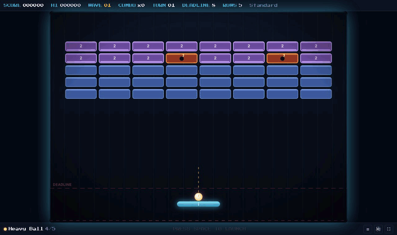
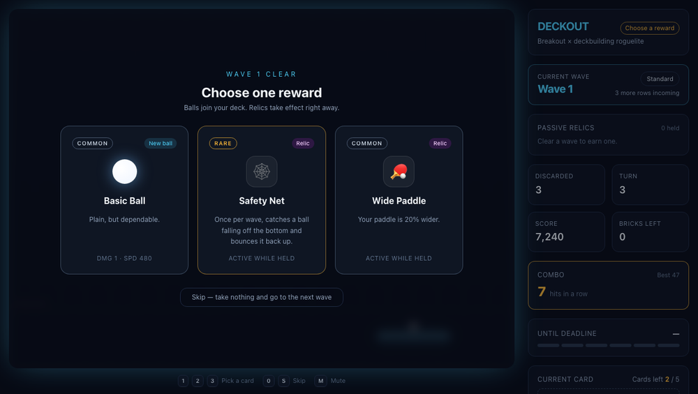
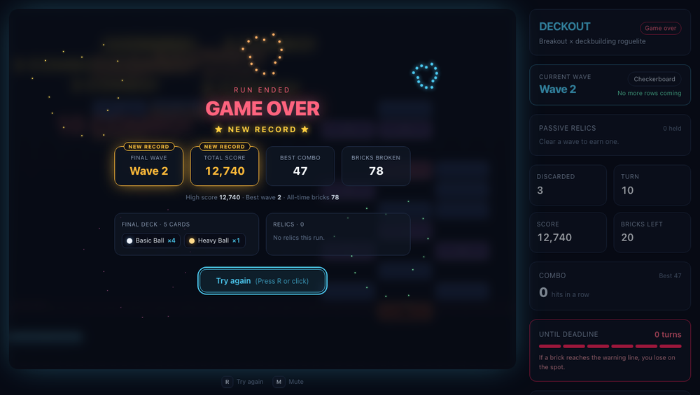

# Deckout

> 고전 벽돌깨기(Breakout) × 덱빌딩 로그라이트. **공 한 발이 카드 한 장이다.**



<sub>실제 플레이 녹화 — 폭탄 벽돌 연쇄 폭발 두 번(10개 · 8개)과 콤보 → 1웨이브 클리어 → 키보드 `2`로 유물(광폭 패들) 선택 → 2웨이브(체스판 진형). 벽돌 파괴와 웨이브 클리어는 전부 정상 게임 경로로 일어난 것이고, 자동화한 것은 공을 따라가는 패들뿐이다.</sub>

## 특징

- **턴제 벽돌깨기** — 덱에서 카드를 한 장 뽑아 그 종류의 공을 쏜다. 공을 놓치면 턴이 끝나고, 벽돌 전체가 한 줄 내려오며 위에서 새 줄이 들어온다. 벽돌이 경고선(데드라인)에 닿으면 패배.
- **덱빌딩** — 웨이브를 비우면 3택 보상. 새 볼 카드(기본 · 중량 · 관통 · 폭탄 · 분열)로 덱을 키우거나 패시브 유물을 얻는다.
- **유물 4종** — 🏓 광폭 패들 · 🔥 화염 도선 · 🕸️ 비상 안전망 · ♻️ 재활용 루틴.
- **웨이브 패턴 6종** — 기본 진형 · 체스판 · 역삼각형 · 보호막 · 다이아몬드 · 기둥. 웨이브가 오를수록 HP 와 단단한 벽돌 비율이 오른다.
- **타격감** — 파티클, 화면 흔들림, 히트스탑, 볼 잔상, 콤보 팝업, 폭탄 연쇄 폭발, WebAudio 합성 효과음.
- **키보드만으로 전 흐름** — 발사, 보상 선택(`1` `2` `3`), 스킵, 음소거, 재도전까지 마우스 없이 가능.
- **기록 저장** — 최고 점수 · 최고 웨이브 · 누적 파괴 수와 설정이 LocalStorage 에 남는다.
- **엔진과 UI 의 완전 분리** — Canvas 60fps 루프는 React 를 모르는 클래스 엔진에서 돌고, React 는 상태 스냅샷만 구독한다.

스택: Vite · React 19 · TypeScript · Tailwind CSS 4 · Canvas 2D. 런타임 의존성은 React 뿐이다.

## 실행

```bash
npm install
npm run dev      # http://localhost:5173
npm run build    # tsc -b && vite build
npm run lint     # oxlint
```

## 조작

| 입력 | 동작 |
|---|---|
| 마우스 이동 | 패들 추종 (감쇠 보간). **창 어디에서든** x 를 따라가므로 커서가 캔버스 밖으로 나가도 패들은 벽까지 간다. HUD 에서 조작 방식을 `키보드`로 바꾸면 마우스에 끌려가지 않는다 |
| 터치 | 캔버스를 **드래그하면 패들 이동(발사 안 됨), 짧게 탭하면 발사**. 보상 선택 · 재도전은 버튼 탭. 조작 방식 설정과 무관하게 항상 동작한다 |
| `A` `D` / `←` `→` | 패들 이동 |
| `Space` / `Enter` / 왼쪽 클릭 | 대기 중인 공 발사 (우클릭 · 휠클릭은 무시) |
| `1` `2` `3` | 보상 카드 선택 (보상 화면) |
| `0` / `S` | 보상 스킵 (보상 화면) |
| `M` | 음소거 토글 |
| `R` | 다시 도전 — 게임 오버 · 승리 화면에서만. 플레이 중 재시작은 HUD 의 "새 게임"이고, 진행 중인 판이면 **3초 안에 한 번 더 눌러야** 확정된다 |

마우스 없이 키보드만으로 발사 → 보상 선택 → 재도전까지 전부 진행할 수 있다. 지금 먹는 키는 화면 하단 가이드에 phase 별로 표시된다.

발사 전에는 공이 패들 위에 붙어 있고, **패들을 움직이는 방향으로 조준선이 기웁니다**(최대 ±36°).

## 게임 규칙

**한 턴 = 카드 한 장 = 공 한 발.**

1. 웨이브가 시작되면 보유 덱을 섞어 드로우 더미를 만든다. 시작 덱은 기본 구체 ×4, 중량 구체 ×1.
2. 턴마다 카드를 한 장 뽑아 그 공을 패들 위에 올린다. 패들을 움직이는 방향으로 조준선이 기울고, 발사하면 공이 필드에 나간다.
3. 공(분열했다면 **모든** 공)이 바닥을 완전히 벗어나면 턴 종료 — 쓴 카드는 버린 더미로 가고, **남은 벽돌 전부가 한 줄 내려오며 맨 윗줄에 새 행이 들어온다.** 새 행은 웨이브마다 정해진 수(증원 한도: 1웨이브 5줄, 웨이브마다 +1줄)까지만 들어오고, 그 뒤로도 하강은 계속된다. 드로우 더미가 비면 버린 더미를 섞어 다시 쓴다.
4. 벽돌 하단이 **데드라인**(패들 위 40px)에 닿으면 게임 오버. 초기 배치에서 아무것도 안 하면 8턴 만에 닿는다.
5. 필드의 벽돌을 전부 파괴하면 웨이브 클리어 → 보상 3택(볼 또는 유물, 스킵 가능) → 다음 웨이브. 10웨이브를 클리어하면 승리.

콤보는 벽돌을 때릴 때마다 오르고, **패들에 맞아도 끊기지 않으며** 공을 잃을 때만 0이 된다. 점수는 벽돌 최대 HP × 100, 웨이브 클리어 시 500 + 드로우 더미에 남은 카드 1장당 120.

### 공

| 카드 | 반경 | 속력 | 대미지 | 특성 | 보상 등급 |
|---|---|---|---|---|---|
| 기본 구체 | 8 | 480 | 1 | — | COMMON |
| 중량 구체 | 12 | 390 | 3 | 느리고 무겁다 | COMMON |
| 관통 구체 | 7 | 540 | 1 | 벽돌을 뚫고 지나간다(반사하지 않음) | RARE |
| 폭탄 구체 | 11 | 420 | 1 | 벽돌을 부술 때마다 반경 74 · 피해 2 폭발 | RARE |
| 분열 구체 | 8 | 470 | 1 | 첫 벽돌에 맞는 순간 셋으로 갈라진다 (튕겨 나가는 방향 기준 ±28°). 분신은 다시 갈라지지 않는다 | RARE |

### 벽돌

색은 **현재 HP** 로 정해져서 맞을 때마다 한 단계씩 내려간다(빨강 5+ → 주황 4 → 분홍 3 → 보라 2 → 파랑 1). HP 2 이상은 숫자와 하단 체력 바로도 표시한다. 도화선이 깜빡이는 **폭탄 벽돌**은 파괴되면 반경 96 · 피해 2로 터지며 다른 폭탄 벽돌을 연쇄로 터뜨린다.

### 유물과 보상 확률

| 유물 | 등급 | 효과 |
|---|---|---|
| 🏓 광폭 패들 | COMMON | 패들 너비 +20% |
| 🔥 화염 도선 | RARE | 모든 볼 속도 +15%, 대미지 +1 |
| 🕸️ 비상 안전망 | RARE | 웨이브당 1회, 바닥으로 떨어지는 공을 받아 위로 튕겨낸다 |
| ♻️ 재활용 루틴 | LEGENDARY | 한 턴에 콤보 5 달성 시 버린 더미에 폭탄 구체 1장 생성 (웨이브 종료 시 소멸) |

등급 등장 확률은 COMMON 70% · RARE 25% · LEGENDARY 5%. 3장 중 볼과 유물이 각각 최소 1장 보장되고, 이미 가진 유물은 다시 나오지 않는다.

## 스크린샷

| 웨이브 클리어 보상 (3택) | 결과창 (신기록) |
|---|---|
|  |  |

## 아키텍처

```
React 렌더 트리            Canvas 60fps 루프
──────────────            ─────────────────
App / HUD / RewardModal   GameEngine (rAF, 고정 타임스텝 1/120s)
      ▲        │            ├─ Physics (순수 함수, DOM 무의존)
      │        │            ├─ ParticleSystem (풀링 + trauma 셰이크)
      │        ▼            └─ entities/ Paddle · Ball · Brick
  GameState  명령 호출
  스냅샷     (launch/chooseReward/restart)
      └──── GameCanvas ────┘
```

- **엔진은 React를 모른다.** DOM 이벤트도 직접 듣지 않고 `setPointer / setKeyDirection / launch` 공개 메서드로 입력을 주입받는다.
- **UI는 캔버스를 모른다.** `engine.subscribe(listener)` 로 `GameState` 스냅샷만 받는다. `patchState` 가 얕은 비교로 변경된 프레임에만 방출하므로 60fps 리렌더가 발생하지 않는다.
- 물리는 고정 타임스텝 서브스텝(1/120s)으로 돌아 프레임레이트와 무관하게 동일하게 동작하며, 탭 복귀 시 death-spiral을 막기 위해 프레임당 누적치를 0.25s로 클램프한다.

### 파일

| 경로 | 역할 |
|---|---|
| `src/config/balance.ts` | **밸런스·튜닝 파라미터의 단일 출처** + 스케일링 공식 + 정합성 검사 |
| `src/utils/storage.ts` | LocalStorage 영속화 — 최고 기록 · 환경설정 (정제 · 실패 내성) |
| `src/engine/InputManager.ts` | DOM 입력 → 게임 명령 어댑터. phase 별 키 매핑 |
| `src/audio/SoundManager.ts` | WebAudio 합성 효과음 |
| `src/types/game.ts` | `BallType`·`DeckCard`·`GameState` 등 엔진/UI 공용 계약, `BALL_STATS` 스탯 테이블 |
| `src/engine/Physics.ts` | 원-AABB 충돌·충돌 면 판정, 다중 사각형 동시 해소, 벽 처리, 패들 각도 반사 (순수 함수) |
| `src/engine/GameEngine.ts` | rAF 루프, 턴·웨이브·덱 상태 머신, 상태 방출 |
| `src/engine/ParticleSystem.ts` | `Particle` 클래스 + 고정 풀, 스파크/파편/폭발 프리셋 |
| `src/engine/FloatingText.ts` | 떠오르는 대미지 숫자·BOOM!·콤보 팝업 (동시 140개 상한) |
| `src/engine/Relics.ts` | 패시브 유물 카탈로그 4종 + 상시 보정치 합산 |
| `src/engine/Rewards.ts` | 웨이브 클리어 보상 3택 추첨 (등급 가중치, 유물 1장 보장) |
| `src/engine/WavePatterns.ts` | 웨이브별 배치 패턴 6종 + HP 스케일링 |
| `src/engine/ScreenShake.ts` | 강도·지속시간 기반 화면 흔들림 (의존성 없는 순수 로직) |
| `src/engine/entities/*.ts` | Paddle / Ball / Brick |
| `src/components/GameCanvas.tsx` | 캔버스 DOM 바인딩, DPR 리사이즈, 입력 → 엔진 전달 |
| `src/components/HUD.tsx` | 웨이브·턴·라이프·덱·현재 카드 |
| `src/components/GameOverModal.tsx` | 결과창 — 통계 · 최종 덱 · 유물 · NEW RECORD 폭죽 |
| `src/components/KeyHints.tsx` | 하단 키보드 조작 가이드 (phase 별) |
| `src/components/RewardModal.tsx` | 웨이브 클리어 보상 카드 선택 |

---

아래부터는 구현하면서 내린 결정과 그 이유를 적은 **설계 노트**다.

## 충돌 처리

벽돌 충돌은 `Physics.resolveAABBBounce` → `Physics.resolveCircleVsRects` 2단으로 처리한다.

**1. 충돌 면 판정** — `circleVsRect` 가 원 중심에서 AABB 최근접점까지의 벡터로 법선·침투 깊이·접점을 구하고, 법선의 지배 축으로 면(`top`/`bottom`/`left`/`right`)을 정한다. 중심이 사각형 내부에 있으면 네 변까지의 거리 중 최소 축으로 밀어낸다. 법선이 대각선에 가까운 모서리 충돌은 **진입 속도의 지배 축**으로 면을 다시 판별한다.

**2. 위치 보정 후 속도 반전** — 침투 깊이만큼 밀어내는 대신 **해당 면 바깥으로 스냅**해(`rect.x - r - skin` 등) 잔여 겹침을 0으로 만든 뒤, 그 축의 속도를 `-Math.abs()` / `+Math.abs()` 로 **부호까지 강제**한다. 단순 부호 반전이 아니므로 이미 빠져나가던 공을 다시 안으로 되돌리지 않는다 → 끼임이 원천적으로 불가능.

**3. 겹친 벽돌 전부를 한 번에** — 가장 깊은 벽돌 하나만 처리하면 두 벽돌 사이에 걸친 공이 매 스텝 번갈아 밀려나며 진동한다. `resolveCircleVsRects` 는 겹친 사각형을 모두 모아 **축(x/y)별로 최대 한 번씩만** 보정·반전한다.

**4. 양쪽에서 동시에 눌리는 경우** — 벽돌 틈(8px)은 공 지름(14~24px)보다 좁아, 그 축으로는 어떤 위치로도 분리할 수 없다. 이때는 그 축을 아예 건드리지 않고 **직교 축으로, 진행 방향을 거스르는 쪽(온 길)** 으로 되돌린다. 가까운 면으로 밀어내면 아래에서 파고든 공이 위로 빠져나가 벽돌 줄을 통과해 버린다.

검증: `src/engine/Physics.ts` 를 Node 24 타입 스트리핑으로 직접 구동해 11개 발사각 × 60초 시뮬레이션에서 잔여 겹침 0 · 필드 이탈 0 · 속력 오차 < 1e-13 · 끼임 프레임 0, 그리고 틈새/모서리 적대적 케이스 9종 전부 통과를 확인했다.

## 턴 사이클과 상태 머신

```
        발사 입력                공 낙하                하강 애니메이션 종료
AIMING ──────────▶ PLAYING ──────────▶ TURN_RESOLVING ──────────────────▶ AIMING
  ▲                   │                      │
  │                   │ 필드 전부 비움        │ 벽돌이 데드라인 도달
  │                   ▼                      ▼
  └── REWARD ◀── (wave < 10)              GAME_OVER
            (wave = 10) ▼
                   VICTORY
```

- **AIMING** — 카드를 한 장 뽑아 그 종류의 공을 패들 중앙 바로 위에 고정 배치한다. `turn.canLaunch = true` 인 동안에만 발사 입력을 받는다.
- **PLAYING** — 공이 바닥을 **완전히**(`y - radius > canvasHeight`) 벗어나면 `onBallLost` 훅이 울리고 턴 정산으로 넘어간다.
- **TURN_RESOLVING** — 남은 벽돌 전부가 한 행(`height + gap` = 36px) 아래로 내려가고, 비워진 맨 윗줄에 새 행이 위에서 미끄러져 들어온다. 0.34초 ease-out 보간이며 이 동안 패들은 계속 움직일 수 있다. 완료 시 턴 카운터 +1.
- **GAME_OVER** — 하강 직후 벽돌 하단이 데드라인(패들 위 40px, y=536)에 닿으면 전환. `onGameOver(summary)` 훅이 울리고 React 의 `GameOverModal` 이 결과창을 띄운다. 흔들림·파티클이 마무리되도록 0.7초 뒤에 루프를 멈춘다.
- **VICTORY** — 목표 웨이브(`VICTORY_WAVE = 10`) 클리어. 스펙에 조건이 정의돼 있지 않아 임의로 정한 값이라 상수 하나로 조정 가능하다.

### 턴이 끝나지 않는 상황 방지

패들이 정중앙에 멈춰 있으면 `aimAngle = -π/2` 라 `vx ≈ 0` 이고, 공이 벽돌 바닥면에 축 정렬 반사된 뒤 패들 정중앙(`offset = 0`, 패들 속도 0 → 스핀 0)으로 돌아와 **수직 왕복만 영원히 반복**한다. 두 겹으로 막는다.

1. `Physics.ensureMinHorizontalSpeed` — 패들 반사 직후 속력을 유지한 채 최소 수평 성분(속력의 2%)을 보장해 대칭을 깬다. 2%만 주는 이유는 "똑바로 위로 쏘는" 감각을 남기기 위해서다. 한 번 중심에서 벗어나면 offset 반사가 알아서 각을 키운다.
2. `MAX_TURN_SECONDS = 45` 스톨 워치독 — 어떤 이유로든 턴이 안 끝나면 강제로 정산한다. 정상 왕복이 2초 안팎이라 통상 플레이에서는 닿지 않는 보험이다.

검증: 패들 고정·정중앙·수직 발사 조건에서 수정 전 120초/패들 54타 동안 미종료(`|vx| = 2.9e-14`), 수정 후 5.7초에 정상 낙하. 패들 x를 450/449/451/300/600/120/780로 바꾼 7케이스 모두 유한 시간 내 종료.

신규 행의 칸별 HP는 **웨이브가 오를수록**(그리고 한 웨이브를 오래 끌수록 조금 더) 단단해지고 빈 칸 확률이 줄어든다(`spawnDifficulty` · `spawnCellHp`). 빈 칸을 반드시 남기는 이유는, 8칸이 매 턴 꽉 차면 공 한 발로는 줄을 걷어낼 수 없어 게임이 성립하지 않기 때문이다.

초기 배치 기준 가장 아래 행의 하단이 264px, 데드라인이 536px, 행 간격이 36px이므로 **손대지 않으면 8턴 만에 패배**한다.

## 게임 필

| 연출 | 구현 | 튜닝값 |
|---|---|---|
| 파티클 | `ParticleSystem` — `Particle` 클래스(위치·속도·크기·색·수명·중력·drag)를 700개 고정 풀에 두고, 매 프레임 살아 있는 구간만 swap-remove 로 앞으로 압축 | 일반 피격 4~6 스파크 / 파괴 15~20 파편 / 폭발 52개(화염 38 + 연기 14) |
| 화면 흔들림 | `ScreenShake` — 강도(px) + 지속시간(ms). **지금 남아 있는 세기보다 약한 요청은 무시** | 피격 1.5/70ms · 파괴 2.6/100ms · 폭발 9/250ms · 패들·낙하 4/150ms |
| 히트스탑 | 물리·파티클을 멈추고 셰이크만 돌린다 | 파괴 32ms · 폭발 50ms |
| 볼 잔상 | `Ball.history` — 최근 8프레임 위치 큐를 반경·알파를 줄여가며 가산 합성 | Normal 흰색 · Bomb 주황 · Pierce 네온 블루 · Heavy 금색 |
| 콤보 | 벽돌을 때릴 때마다 +1. **패들 반사로는 끊기지 않고 공을 잃을 때만 0** | 3타부터 표시. 충돌 1회당 팝업 1개 |

**그릴 게 없으면 그리지 않는다** — 보상 화면에서는 모달이 캔버스를 덮고 물리도 멈춰 있다. 클리어 순간의 파티클·텍스트·흔들림이 가라앉은 뒤에는 갱신과 렌더를 통째로 건너뛴다(메인 스레드 111ms/s → 19.8ms/s). `devicePixelRatio` 는 2 로 제한한다 — 백버퍼는 DPR² 로 늘어나 DPR 3 에서 520만 픽셀을 매 프레임 다시 칠하는데, 글로우 위주의 그래픽이라 2 를 넘겨도 눈에 띄는 이득이 없다. 플로팅 텍스트의 글자 폭은 처음 그릴 때 한 번만 잰다(`measureText` 3,116회 → 82회, 텍스트 82개 기준).

**히트스탑이 `accumulator` 를 건드리지 않는 이유** — 멈춘 동안의 시간을 모아 뒀다가 몰아서 돌리면 정지 직후 물리가 순간 가속한다. 프레임을 그냥 빠져나가 물리 시간 자체를 흐르지 않게 해야(time-scale 0) 의도한 "멈칫"이 된다.

**콤보 팝업은 충돌 1회당 하나만** — 벽돌을 때릴 때마다 팝업을 띄우면, 연쇄 폭발에서 한 프레임에 여러 개가 겹쳐 `13 COMBO!BOOM!` 처럼 읽을 수 없게 된다. 충돌 처리가 끝난 뒤 최종 콤보로 한 번만 띄우되, 평범한 랠리(한 번에 1타)에서는 홀수 콤보에서만 표시해 화면이 시끄럽지 않게 한다. `BOOM!` 도 연쇄 앞 두 번만 띄우고 나머지는 파티클로만 보여준다.

**약한 흔들림이 강한 흔들림을 무한 연장하지 못하게** — "약하고 **동시에** 짧을 때만 무시" 같은 조건을 쓰면, 패들 진동(4/150ms)처럼 자주 오는 요청이 폭발(9/250ms)의 `elapsed` 를 계속 0으로 되돌려 랠리 내내 최대 강도로 흔들린다. 지금 남아 있는 세기(`intensity × (1 - elapsed/duration)`)와 비교해 그보다 약하면 통째로 무시한다.

**종료 연출 정산 창** — `GAME_OVER`/`VICTORY` 로 넘어가는 순간 곧바로 `stop()` 하면, 그때 걸려 있던 흔들림이 감쇠할 프레임을 못 얻어 0이 아닌 오프셋으로 영구 고정된다. 이후 `resize()` 가 부르는 `render()` 마다 장면이 어긋나므로, 0.7초(`TERMINAL_SETTLE_SECONDS`) 동안 더 돌린 뒤 멈춘다.

**폭발 후 반사를 다시 계산한다** — 충돌 해소 결과는 피해를 주기 *전* 기하로 계산한 값이다. 그 사이 폭발이 그 벽돌들을 날려버렸다면 이미 사라진 벽돌에 튕기는 유령 반사가 된다. 폭발 처리 후 살아남은 벽돌로 한 번 더 계산한다.

**흔들림을 논리 좌표계에서 적용하는 이유** — `ctx.save()` → 논리 단위 변환 → `ctx.translate(offset)` → 렌더 → `ctx.restore()` 순서라, 캔버스가 CSS 로 확대/축소돼도 체감 강도가 같다. 화면 지우기(`clearRect`)와 게임오버 오버레이는 흔들림 **밖**에서 처리한다 — 각각 가장자리 잔상과 읽기 어려움을 막기 위해서다.

### 폭탄

- **폭탄 구체**(`BallType 'bomb'`) — 벽돌을 부술 때마다 타격 지점에서 반경 74, 피해 2로 폭발. 보상 풀에 rare 로 등장.
- **폭탄 벽돌**(`BrickType 'bomb'`) — 파괴되면 반경 96, 피해 2로 폭발하며 **연쇄**한다. 스폰 확률은 턴에 따라 5%→최대 14%.
- 연쇄는 재귀가 아니라 큐로 처리하고 `MAX_CHAIN_BLASTS = 24` 로 끊는다. 전 칸이 폭탄인 최악의 경우에도 24회에서 종료되는 것을 수치로 확인했다.

## 웨이브 · 보상 · 유물

### 웨이브 클리어 → 보상 → 다음 웨이브

필드의 활성 벽돌이 모두 파괴되는 순간 `clearWave()` 가 돈다: 공을 패들 중앙에 고정 → 쓰던 카드를 버린 더미로 → `phase = 'REWARD'`(이 phase 에서는 `step()` 이 아무것도 하지 않아 물리가 멈춘다) → 보상 3장 추첨 → `GameState.rewardChoices` 와 `onWaveClear(rewards, wave)` 훅으로 방출. React 의 `RewardModal` 은 상태만 보고 뜨고, 선택/스킵 시 `engine.chooseReward(id)` / `engine.skipReward()` 를 부르면 엔진이 웨이브를 올리고 `AIMING` 으로 돌아온다.

### 보상 (`RewardItem`)

`{ type: 'BALL', ball }` 또는 `{ type: 'RELIC', relic }`. 등급 가중치는 COMMON 6 : RARE 3 : LEGENDARY 1. 이미 가진 유물은 다시 나오지 않는다. 아직 못 가진 유물이 남아 있으면 **3장 중 최소 1장은 유물**, 그리고 **항상 최소 1장은 볼**로 보장한다 — 볼만 세 장이면 유물 시스템이 묻히고, 유물만 세 장이면 그 웨이브에는 덱을 키울 방법이 없어 "덱 성장 vs 패시브"라는 핵심 선택이 사라진다. 유물을 다 모으면 볼만 나온다.

### 유물 (`Relic`)

유물은 두 방식으로 개입한다 — 보유만으로 적용되는 **상시 보정치**(`modifiers`)와, 특정 순간 엔진이 호출하는 **훅**. 훅은 `RelicContext`(충전 소모 · 버린 더미에 카드 생성 · 알림) 로만 엔진에 영향을 주며 내부를 직접 만지지 못한다. 충전 횟수 같은 런타임 상태는 유물 객체가 아니라 엔진이 들고 있어서, 카탈로그의 정의 객체는 불변이다.

| 유물 | 등급 | 효과 | 구현 방식 |
|---|---|---|---|
| 🏓 광폭 패들 | COMMON | 패들 너비 +20% | `modifiers.paddleWidthMul` — 획득 즉시 반영 |
| 🔥 화염 도선 | RARE | 볼 속도 +15%, 대미지 +1 (+ 불씨 잔상) | `modifiers` — 다음에 만들어지는 공부터 |
| 🕸️ 비상 안전망 | RARE | 웨이브당 1회 낙하 방지 | `onBallFall` + `chargesPerWave: 1`. 웨이브 시작 때 재충전 |
| ♻️ 재활용 루틴 | LEGENDARY | 한 턴에 콤보 5 달성 시 버린 더미에 폭탄 구체 생성 | `onCombo(before, after)` |

스펙의 훅 3종(`onPaddleHit` / `onBrickDestroy` / `onTurnEnd`)은 엔진이 해당 시점에 호출하지만, 초기 4종에는 맞는 자리가 없어 `onBallFall` · `onCombo` 를 추가했다. 재활용 루틴은 폭발로 콤보가 3→9 처럼 건너뛸 수 있어 "5에 도달했는가"가 아니라 "5를 **지나쳤는가**"로 판정한다. 생성된 폭탄은 **임시 카드**로, 웨이브가 끝나면 사라진다(영구 덱이 매 턴 불어나는 것을 막기 위해).

### 덱 순환

`deck`(영구) / `drawPile` / `discardPile` 3분할. 턴이 끝나면 쓴 카드가 버린 더미로 가고, 드로우 더미가 비면 버린 더미를 섞어 다시 드로우 더미로 만든다. 웨이브가 시작될 때는 영구 덱을 새로 섞으므로, 보상으로 고른 볼은 **다음 웨이브의 드로우 더미에 바로 포함**된다.

### 웨이브 스케일링

| 웨이브 | 1 | 2 | 3 | 4 | 5 | 6 | 7… |
|---|---|---|---|---|---|---|---|
| 패턴 | 기본 진형(40) | 체스판(20) | 역삼각형(20) | 보호막(32) | 다이아몬드(18) | 기둥(20) | 2번부터 순환 |

`setGridConfig` 로 그리드를 아주 작게(예: 2×2) 잡으면 다이아몬드 같은 패턴이 한 칸도 못 채울 수 있다. 벽돌 0개로 시작한 웨이브는 "마지막 벽돌 파괴" 순간이 오지 않아 영원히 끝나지 않으므로, 그런 경우 기본 진형으로 되돌린다.

`VICTORY_WAVE = 10`. 웨이브가 오르면 네 가지가 함께 변한다(전부 `src/config/balance.ts`).

| 웨이브 | 1 | 2 | 3 | 4 | 5 | 6 | 7 | 8 | 9 | 10 |
|---|---|---|---|---|---|---|---|---|---|---|
| 모든 벽돌 HP 보너스 `floor((w-1)×0.75)` | +0 | +0 | +1 | +2 | +3 | +3 | +4 | +5 | +6 | +6 |
| 단단한 벽돌(+1) 확률 | 0% | 12% | 24% | 36% | 48% | 60% | 60% | 60% | 60% | 60% |
| 시작 위치 하강 (데드라인까지 여유 턴) | 0줄 (8) | 0 (8) | 0 (8) | 1줄 (7) | 1 (7) | 1 (7) | 2줄 (6) | 2 (6) | 2 (6) | 3줄 (5) |
| 증원 한도 (새 줄 수) | 5 | 6 | 7 | 8 | 9 | 10 | 11 | 12 | 13 | 14 |
| 새 줄 한 줄의 기대 HP | 7.3 | 8.1 | 8.9 | 9.8 | 10.6 | 13.4 | 16.4 | 17.6 | 18.7 | 23.0 |

행별 기본 HP 는 위에서부터 `2, 2, 1, 1, 1`.

#### 이렇게 정한 이유 (봇 계측)

엔진의 `step()` 을 동기 루프로 직접 돌리면 몇 분짜리 판을 몇 초에 시뮬레이션할 수 있다. 실력이 다른 봇 셋(공이 내려올 때마다 3% / 15% / 35% 확률로 놓침)으로 계측했다.

처음 밸런스의 문제는 세 가지였다.

1. **1웨이브가 가장 무거웠다** — 고수 봇 기준 1웨이브 140초, 2웨이브 70초. 40칸 72 HP 의 전체 그리드로 시작해 놓고 이후 패턴은 18~32칸이었다.
2. **새 줄의 단단함이 "게임 시작부터의 누적 턴"에 비례했다** — 느린 플레이어일수록 턴이 쌓여 줄이 더 단단해지고, 그래서 더 느려지는 악순환. 보통 실력 봇의 3웨이브가 16턴·202초짜리 늪이 됐다. → 웨이브 진행 기준으로 바꾸고, 한 웨이브를 끈 만큼만 조금 가산.
3. **새 줄이 끝없이 들어왔다** — 깎는 속도가 들어오는 속도와 비슷한 플레이어에게는 웨이브 길이에 상한이 없었다. 초보 봇은 1웨이브를 23%만 깼고, 그래서 **보상 화면(이 게임의 핵심 루프)을 영영 보지 못했다.** → 웨이브별 증원 한도.

증원 한도를 넣자 반대로 너무 쉬워졌다(초보 봇도 30판 중 14판 우승). 끝없는 새 줄이 사실상 유일한 위협이었기 때문이다. HP 만 올리면 웨이브가 *위험해지는* 게 아니라 *길어질* 뿐이라(한 판 20분 이상), **후반 웨이브일수록 더 낮은 곳에서 시작**하게 해서 길이를 늘리지 않고 데드라인 압박을 올렸다.

| 봇 | 조정 전 | 조정 후 |
|---|---|---|
| 고수 (3% 실수) | 1웨이브 140초 / 2웨이브 70초 | 1웨이브 66초, 웨이브당 66→133초로 완만히 상승 · 승률 73% (나머지는 25분 제한 초과) |
| 보통 (15%) | 3웨이브가 16턴·202초 · 도달 웨이브 중앙값 5 | 웨이브 클리어율 100% → 80%(8웨이브)로 완만히 하락 · 중앙값 9 · 승률 43% |
| 초보 (35%) | 1웨이브 클리어 23% · 30판 전부 1~3웨이브에서 패배 | 1~3웨이브 100% 클리어(보상 세 번은 본다) → 4웨이브 73% → 8웨이브 23% · 중앙값 6 · 승률 3% |

조정 후 수치는 사람처럼 **가장 낮은 벽돌 아래로 패들을 옮겨 수직으로 발사하는** 봇 기준이다. 초보 봇의 패배를 뜯어보니 33판 전부에서 데드라인에 닿은 맨 아랫줄에 벽돌이 2개 이하(25판은 1개)만 남아 있었다 — HP 총량이 아니라 **떠내려오는 낙오 벽돌 하나**가 판을 끝낸다. 매 턴의 발사가 그 낙오 벽돌을 노릴 수 있는 공짜 조준 사격이라는 점이 이 게임의 핵심 판단이다.

봇은 지치지도 배우지도 않으므로 이 수치는 **상대 비교용**이다. 사람이 해 보고 어긋나면 위 표의 숫자만 바꾸면 된다.

안전망이 되튕긴 공은 올라가는 길에 **패들을 통과**한다. 의도된 동작이다 — 패들 아랫면에 막히면 공이 다시 바닥으로 떨어져, 패들이 공 위에 있을 때마다 안전망이 무용지물이 된다.

### 개발용 핸들

DEV 빌드에서만 `window.__deckout` 으로 엔진이 열린다(프로덕션 번들에는 문자열조차 남지 않음을 확인). `__deckout.debugClearBricks()` 는 남은 벽돌을 **정상 피해 경로로** 모두 파괴해 웨이브 클리어 흐름을 결정적으로 재현한다 — 40칸을 실제로 다 깨야만 보상 모달을 볼 수 있으면 자동화 검증이 불가능하기 때문이다.

## 밸런스 · 영속화 · 입력

### 밸런스 파라미터 (`src/config/balance.ts`)

엔진·엔티티·물리·보상·유물에 흩어져 있던 매직 넘버를 `BALANCE` 객체 하나로 모았다. 의존성이 전혀 없는 순수 모듈이라 어느 계층에서든 읽을 수 있다. 공식은 함수로 뺐다 — `waveHpBonus(wave)` · `toughBrickChance(wave)` · `bombBrickChance(turn)` · `spawnCellHp(turn, r)` · `clampBallSpeed(speed)`.

- **볼 속력 상한** `ball.maxSpeed = 720`. 유물 배율이 몇 개가 겹쳐도 넘지 않는다. 서브스텝당 이동량(720 × 1/120 = 6px)이 가장 얇은 충돌체(패들 16px)의 절반을 넘으면 이산 충돌 판정이 공을 놓치기 시작하므로, `validateBalance()` 가 이 관계를 포함한 정합성을 검사하고, 개발 빌드에서는 `main.tsx` 가 시작할 때 호출해 문제를 콘솔에 올린다. 수치를 만지다 터널링을 다시 들이는 것을 막는 안전장치다.
- **패들 판정 여유** `paddle.hitForgiveness = 4px`. **윗면 모서리**를 아슬아슬하게 빗나간 공만 받아준다 — 실제 패들에 안 맞았고, 공 중심이 윗면보다 위에 있고, 넓힌 판정에서도 "윗면" 충돌일 때만. 패들 전체를 좌우로 넓히면 옆면까지 넓어져, 패들 옆을 그냥 지나가던 공이 허공에 튕기는 "유령 패들"이 생긴다(처음에 그렇게 구현했다가 리뷰에서 걸렸다: 패들 주변 16만 샘플 스윕에서 유령 충돌 2,864건 → 0건). 반사각은 실제 패들 기준으로 계산하므로 조작감은 그대로다.
- **보상 등급 확률** COMMON 70% · RARE 25% · LEGENDARY 5%. 후보별 가중치로 한 번에 뽑으면 같은 등급의 후보 수가 확률을 흔들기 때문에(COMMON 후보가 6개면 6배로 부푼다), **등급을 먼저 뽑고 그 안에서 균등하게** 고른다. 후보가 없는 등급은 빼고 남은 확률을 비율대로 다시 나눈다. COMMON 6 · RARE 1 · LEGENDARY 1개짜리 풀에서 20만 회 → 69.91 / 25.10 / 4.99%.
- 리팩터링 전후 동작 동일성: 물리·끼임·소프트락·주스·보상·패턴 회귀 7종 통과, 신규 행 HP 공식은 연속 난수 200만 회에서 불일치 0.

### 영속화 (`src/utils/storage.ts`)

`deckout:records:v1`(최고 점수 · 최고 웨이브 · 누적 파괴 벽돌)과 `deckout:settings:v1`(음소거 · 조작 방식). 저장소는 언제든 실패한다고 가정한다 — 모든 접근을 try/catch 로 감싸고, 읽은 값은 반드시 정제하며(음수·NaN·Infinity·문자열·배열·깨진 JSON → 기본값), 쓰기에 실패해도 게임은 메모리상의 값으로 계속 돈다. 백엔드를 인자로 주입받아 DOM 없이 검증한다.

신기록 판정: 점수는 이전 기록을 **넘었을** 때(동점·0점 제외), 웨이브는 넘었고 2웨이브 이상일 때(첫 판에 "신기록: 웨이브 1" 이 뜨지 않게). 끝난 판은 엔진의 `onGameOver`/`onVictory` 훅에서 **정확히 한 번** 집계하고, "새 게임"으로 진행 중인 판을 버릴 때는 파괴 수만 누적한다.

### 입력 (`src/engine/InputManager.ts`)

`resolveKey(key, phase)` 가 같은 키를 phase 에 따라 다르게 해석한다 — `1·2·3`/`0·S` 는 보상 화면에서만, `R` 은 종료 화면에서만, `Space`/`Enter` 는 플레이 중에만 가져간다(모달이 떠 있을 때는 포커스된 버튼의 기본 동작에 맡긴다). 그 밖에: Ctrl/Cmd/Alt 조합은 건드리지 않고(`Cmd+R` 새로고침이 재시작으로 둔갑하지 않게), 키를 누르고 있어도 단발 명령은 한 번만 실행하며, 눌린 키는 소문자로 정규화해 추적한다(`a` 를 누른 채 Shift 를 떼면 keyup 이 `A` 로 와서 패들이 멈추지 않던 문제).

### 포인터 추종과 터치

포인터 이동은 캔버스가 아니라 **창 전체**에서 듣고, 마우스가 창을 벗어나는 순간의 x 도 받는다. 범위 밖의 x 는 가까운 벽으로 붙는다. 처음에는 캔버스에서만 듣고 벗어나면 추종 목표를 `null` 로 만들었는데, 그러면 공을 살리려고 벽 쪽으로 빠르게 휘두른 마우스가 캔버스를 나가는 순간 패들이 감쇠 보간 도중에 굳었다 — 129ms 스윕에 69.6px, 108ms 스윕에 143.2px(패들 폭 130px 이상) 모자란 채로. 지금은 5ms 짜리 순간이동 스윕에서도 모자람 0px.

터치/펜은 **캔버스에서 시작한 드래그만** 따라간다(`pointerId` 추적) — 창 전체에서 듣다 보니 HUD 를 스크롤하려고 댄 손가락까지 패들을 끌 수 있어서다. 그리고 `키보드` 조작 모드가 무시하는 것은 마우스 위치뿐이다: 터치는 언제나 의도적인 조작이므로 모드와 상관없이 받는다. 그러지 않으면 키보드가 없는 폰에서 `키보드`를 한 번 탭하는 순간 패들을 움직일 방법이 사라지고, 설정이 저장되어 새로고침해도 풀리지 않는다.

### 모달

- `aria-modal` 을 선언한 만큼 모달이 떠 있는 동안 HUD 를 **`inert`** 로 만든다. 그러지 않으면 Tab 8번에 모달 뒤의 "새 게임"에 닿고, 마우스로는 그냥 눌린다.
- 보상 모달의 포커스는 첫 카드가 아니라 **다이얼로그 자체**에 둔다. 첫 카드에 두면 발사하려고 Space 를 누르던 손가락이 그대로 첫 카드를 골라 버린다. 같은 이유로 모달이 뜬 직후 0.5~0.6초의 클릭/Enter 는 무시한다(`useActivationGrace`) — 키보드 `1·2·3` 과 `R` 은 의도적인 입력이라 즉시 받는다.
- `lg` 미만 화면에서는 모달을 캔버스 박스가 아니라 **화면 전체를 덮는 스크롤 가능한 오버레이**로 띄우고, 가려진 HUD 대신 덱/유물 요약을 모달 안에 넣는다. 캔버스 박스(폰에서 250px 남짓)에 가둔 채 flex 중앙정렬을 하면 세로로 쌓인 카드의 첫 장이 문서 위쪽(y=−236)으로 밀려 스크롤로도 닿을 수 없다.
- 보상 카드의 DMG/SPD 는 기본 스탯표가 아니라 **보유 유물이 반영된, 실제로 날아갈 공의 수치**다.

### 결과창 (`src/components/GameOverModal.tsx`)

캔버스 텍스트 오버레이를 React 모달로 교체했다. 최종 웨이브 · 점수 · 최장 콤보 · 파괴 벽돌, 최종 덱과 유물 요약, 신기록이면 해당 타일에 NEW RECORD 배지 + 네온 맥동 + CSS 폭죽(`prefers-reduced-motion` 에서는 숨김). 재도전 버튼에 자동 포커스를 줘서 `R` · `Enter` · `Space` · 클릭 모두 된다.

### 사운드 (`src/audio/SoundManager.ts`)

오디오 파일 없이 오실레이터와 노이즈로 합성하며, 엔진은 소리를 모른다 — `App` 이 엔진 훅을 받아 넘겨준다. 브라우저 정책상 첫 키 입력/클릭 때 컨텍스트를 연다.

## 엔진 훅

`engine.setHooks({ ... })` 로 게임플레이 이벤트를 구독한다. 엔진은 소리도 저장소도 모른다 — 그런 바깥 계층을 붙이는 자리가 여기다.

```ts
engine.setHooks({
  onTurnStart: (turn) => {},
  onLaunch: () => {},
  onPaddleHit: () => {},
  onBrickHit: () => {},                       // 때렸지만 파괴하지 못함
  onBrickDestroyed: (brick) => {},            // brick 은 순수 데이터 스냅샷
  onExplosion: () => {},                      // 연쇄면 여러 번
  onBallLost: (turn) => {},
  onTurnEnd: (turn) => {},                    // 하강 정산 완료
  onWaveClear: (rewards, wave) => {},         // 추첨된 보상 3장
  onRewardResolved: (picked) => {},           // 스킵이면 null
  onGameOver: (summary) => {},                // RunSummary: 웨이브·점수·콤보·파괴 수·덱·유물
  onVictory: (summary) => {},
});
engine.setGridConfig({ rows: 6, cols: 10 }); // 다음 웨이브부터 적용
```

`src/App.tsx` 가 이 훅들로 효과음을 울리고, `onGameOver` / `onVictory` 에서 기록을 저장한 뒤 결과창을 띄운다.

## 검증 방식

테스트 러너는 아직 없다. 대신 단계마다 세 가지를 돌렸다.

- **수치 시뮬레이션** — 순수 모듈(`Physics` · `balance` · `storage` · `Rewards` · `Relics` · `WavePatterns` · `InputManager.resolveKey` · `ParticleSystem` · `ScreenShake`)은 DOM 의존이 없고 `.ts` 확장자로 import 하므로, Node 24 의 타입 스트리핑으로 **실제 소스를 그대로** 실행한다. 예: 11개 발사각 × 60초 플레이에서 잔여 겹침 0 · 필드 이탈 0 · 속력 오차 < 1e-13, 패들 주변 16만 위치 스윕에서 유령 충돌 0, 보상 등급 20만 회 추첨에서 69.91 / 25.10 / 4.99%.
- **적대적 코드 리뷰** — "이 코드가 맞다는 주장을 반증하라"는 과제로 독립 리뷰를 돌리고, 실행된 재현이 붙은 지적만 버그로 인정해 고쳤다. 인접 벽돌 틈 관통, 패들 정중앙 수직 무한 랠리(소프트락), 약한 흔들림이 강한 흔들림을 무한 연장하는 문제, 폭발로 사라진 벽돌에 튕기는 유령 반사, 유령 패들 등이 이렇게 잡혔다.
- **브라우저 실측** — Playwright 로 실제 빌드를 구동해 캔버스 픽셀과 DOM 을 측정했다(벽돌 하강량 36px, 히트스탑 36ms 정지 구간, 패들 너비 130→156px, LocalStorage 값과 결과창 수치의 일치 등).

## 알려진 한계와 다음 단계

- 밸런스는 봇 계측으로 잡았다. 사람이 실제로 해 본 데이터가 아니며, 10웨이브 완주에 17~19분이 걸려 가벼운 웹 게임치고는 길 수 있다(`waves.victoryWave` 로 조정).
- 폭탄 벽돌은 웨이브 HP 스케일과 무관하게 항상 HP 1 이다(폭탄은 벽이 아니라 기폭 장치라는 의도). 보호막 패턴의 +2 행에 걸리면 그 칸만 약해진다.
- 벽돌의 `tough`/`core` 분류(`BrickType`)는 데이터로만 나가고 동작에는 쓰이지 않는다.
- 성능 실측은 Apple M4(GPU 가속 헤드리스)에서만 했다: `render()` 평균 0.35~0.58ms, 최악 3.1ms, long task 0. 헤드리스의 rAF 는 vsync 에 묶이지 않아 **실제 디스플레이의 프레임 페이싱과 저사양/모바일 GPU 비용은 미측정**이다. 벽돌별 그라디언트/섀도 캐시는 호출 수 증가는 확인됐지만 시간 이득이 입증되지 않아 적용하지 않았다.
- 두 탭이 1ms 안쪽으로 동시에 판을 끝내면 기록 쓰기가 서로를 덮을 수 있다(read-modify-write). 자연 발생은 사실상 불가능해 그대로 뒀다. 다른 탭의 기록 갱신은 `storage` 이벤트로 HUD 에 반영된다.
- 효과음은 합성음이며 실제 청취 튜닝을 거치지 않았다. 페이지를 그냥 닫아 버린 진행 중인 판의 파괴 수는 누적되지 않는다.
- `VICTORY_WAVE = 10` 등 일부 수치는 임의로 정한 값이다 — 전부 `src/config/balance.ts` 에서 조정한다.
- 후보: 카드 강화·제거, 보스 웨이브, 이동/회복 벽돌, 시드 고정 리플레이, 테스트 러너 도입(현재의 Node 시뮬레이션 스크립트를 옮겨 담기).
